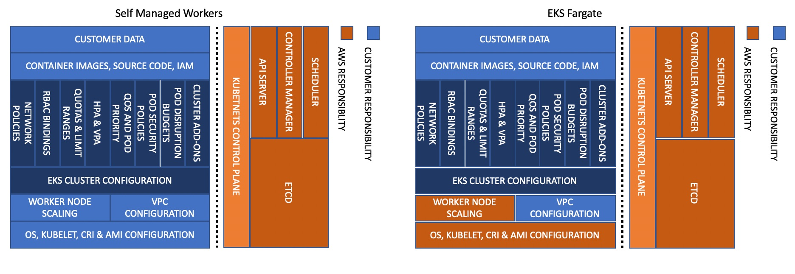
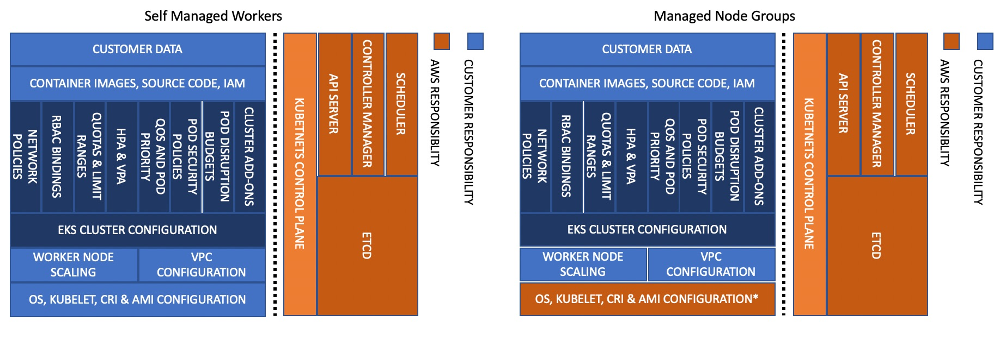

# Amazon EKS 安全最佳实践
该指南提供了有关保护依赖于EKS的信息，系统和资产的建议，同时通过风险评估和缓解策略提供业务价值。 本指南是AWS正在发布的一系列最佳实践指南的一部分，以帮助客户根据最佳实践实施EKS。 有关性能，卓越运营，成本优化和可靠性的指南将在未来几个月内提供。

## 如何使用本指南
本指南面向对EKS集群及其支持的工作负载的安全控制有效性负责实施和监视的安全从业人员。 为了便于使用，该指南分为不同的主题区域。 每个主题都以简要概述开始，然后是保护EKS群集的建议和最佳实践的列表。 主题无需按特定顺序阅读。

## 理解责任分担模型
使用诸如EKS之类的托管服务时，安全性和合规性被认为是共同的责任。 通常，AWS负责“云”中的安全性，而您（客户）负责云中“云”中的安全性。 通过EKS，AWS负责管理EKS管理的Kubernetes控制平面。 其中包括Kubernetes 主节点，ETCD数据库以及AWS提供安全可靠的服务所需的其他基础架构。 作为EKS的使用者，您应对本指南中的主题负主要责任，例如 IAM，pod安全性，runtime安全性，网络安全性等。 

在基础架构安全方面，当您从自我管理的工作节点转移到托管的节点组再到Fargate时，AWS将承担其他责任。 例如，通过Fargate，AWS负责保护用于运行Pod的基础实例/runtime。 

当您使用受管节点组（MNG）时，AWS也将承担保护和维护基础实例的责任。 但是，与Fargate不同，MNG不会自动扩展您的基础架构/集群.  可以通过 [cluster-autoscaler](https://github.com/kubernetes/autoscaler/blob/master/cluster-autoscaler/cloudprovider/aws/README.md) 或其他技术，例如原生的AWS autoscaling, SpotInst的 [Ocean](https://spot.io/solutions/kubernetes-2/), 或者 Atlassian的 [Escalator](https://github.com/atlassian/escalator). 

在设计系统之前，重要的是要知道您的职责和服务提供者（AWS）之间的分界线在哪里。

有关责任分担模型的其他信息，请参见 https://aws.amazon.com/compliance/shared-responsibility-model/

## 介绍
使用托管的Kubernetes服务（如EKS）时，有几个与安全性最佳实践有关的领域:

+ Identity and Access Management 身份和访问管理
+ Pod Security
+ Runtime Security
+ Network Security
+ Multi-tenancy 多租户
+ Detective Controls 侦探控制
+ Infrastructure Security 基础设施安全
+ Data Encryption and Secrets Management 数据加密和秘密管理
+ Regulatory Compliance 合规性
+ Incident Response 事件响应

在设计任何系统时，您需要考虑其安全隐患以及可能影响安全状况的实践。 例如，您需要对谁可以对一组资源执行操作控制。 您还需要具有以下能力：快速识别安全事件，保护系统和服务免遭未经授权的访问以及通过数据保护维护数据的机密性和完整性。 拥有一套定义完善并经过预演的流程来应对安全事件，也将改善您的安全状况。 这些工具和技术很重要，因为它们支持诸如防止财务损失或遵守监管义务之类的目标。

AWS通过提供丰富的安全服务来帮助组织实现其安全性和合规性目标，这些服务是根据来自广泛的具有安全意识的客户的反馈而发展而来的。 通过提供高度安全的基础，客户可以将更少的时间花费在“毫无区别的繁重工作”上，而将更多的时间用于实现其业务目标。

## 反馈
该指南已在GitHub上发布，以收集来自更广泛的EKS / Kubernetes社区的直接反馈和建议。 如果您有最佳实践，认为我们应该将其包括在指南中，请提出问题或在GitHub存储库中提交PR。 我们的目的是在向服务中添加新功能时或在新的最佳实践发展时，定期更新指南。 

## 进一步阅读
[Kubernetes Security Whitepaper](https://github.com/kubernetes/community/blob/master/wg-security-audit/findings/Kubernetes%20White%20Paper.pdf), 本白皮书由安全审计工作组赞助，描述了Kubernetes攻击面和安全体系结构的关键方面，旨在帮助安全从业人员做出合理的设计和实施决策。
