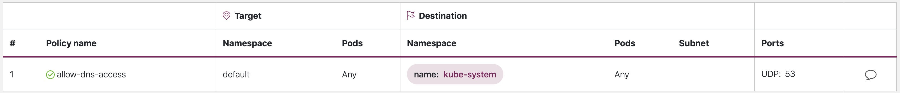

# 网络安全
网络安全性有多个方面。 首先涉及规则的应用，这些规则限制了服务之间的网络流量。 第二种是在传输过程中对流量进行加密。 在EKS上实施这些安全措施的机制多种多样，但通常包括以下各项:

#### 流量控制
+ 网络策略
+ 安全组
#### 传输中的加密
+ 服务网格
+ 容器网络接口(CNIs)
+ Nitro Instances

## 网络策略
在Kubernetes集群中，默认情况下允许所有Pod到Pod通信。尽管这种灵活性可能有助于促进实验，但是它并不安全。 Kubernetes网络策略为您提供了一种机制来限制Pod之间（通常称为东西方流量）之间以及Pod与外部服务之间的网络流量。 Kubernetes网络策略在OSI模型的第3层和第4层运行。网络策略使用容器选择器和标签来标识源容器和目标容器，但也可以包括IP地址，端口号，协议号或它们的组合。  [Calico](https://docs.projectcalico.org/introduction/),是 [Tigera](https://tigera.io)的开放源代码策略引擎，可与EKS协同工作。除了实现完整的Kubernetes网络策略功能集之外，Calico还支持具有更丰富功能集的扩展网络策略，包括对第7层规则的支持，例如与Istio集成时使用HTTP。同样，[Cilium](https://cilium.readthedocs.io/en/stable/intro/)的维护者还扩展了网络策略，以部分支持对第7层规则的支持，例如HTTP。 Cilium还支持DNS主机名，这对于限制Kubernetes Services/Pods与VPC内外运行的资源之间的通信很有用。相比之下，Calico Enterprise包含一项功能，可让您将Kubernetes网络策略映射到AWS安全组以及DNS主机名 

!!! 注意
    首次配置EKS群集时，默认情况下未安装Calico策略引擎。 可以在VPC CNI存储库 https://github.com/aws/amazon-vpc-cni-k8s/tree/master/config 中找到安装Calico的清单。 .

Calico策略的范围可以是命名空间，窗格，服务帐户或全局。 当策略的范围限定于服务帐户时，它将一ingress/egress规则与该服务帐户相关联。 使用适当的RBAC规则，您可以防止团队覆盖这些规则，从而使IT安全专业人员可以安全地委托名称空间管理.

您可以在 https://github.com/ahmetb/kubernetes-network-policy-recipes 上找到常见的Kubernetes网络策略列表。 可在 https://docs.projectcalico.org/security/calico-network-policy 上找到有关Calico的一组类似规则。 

## 推荐建议

### 创建默认的拒绝策略
与RBAC策略一样，网络策略应遵循最小特权访问策略。 首先创建拒绝所有策略以限制来自命名空间的所有入站和出站流量，或者使用Calico创建全局策略.

_Kubernetes网络策略_
```yaml
apiVersion: networking.k8s.io/v1
kind: NetworkPolicy
metadata:
  name: default-deny
  namespace: default
spec:
  podSelector: {}
  policyTypes:
  - Ingress
  - Egress
```


!!! 提示 
    上图是由网络策略查看器[Tufin](https://orca.tufin.io/netpol/)创建的 .

_Calico 全局网络策略_
```yaml
apiVersion: crd.projectcalico.org/v1
kind: GlobalNetworkPolicy
metadata:
  name: default-deny
spec:
  selector: all()
  types:
  - Ingress
  - Egress
```

### 创建规则以允许DNS查询 
一旦有了默认的“全部拒绝”规则，就可以开始在其他规则上分层，例如允许Pods查询CoreDNS进行名称解析的全局规则。 您首先要标记名称空间: 

```
kubectl label namespace kube-system name=kube-system
```

然后添加网络策略:

```yaml
apiVersion: networking.k8s.io/v1
kind: NetworkPolicy
metadata:
  name: allow-dns-access
  namespace: default
spec:
  podSelector:
    matchLabels: {}
  policyTypes:
  - Egress
  egress:
  - to:
    - namespaceSelector:
        matchLabels:
          name: kube-system
    ports:
    - protocol: UDP
      port: 53
```



_Calico 全局策略等效(equivalent)_

```yaml
apiVersion: crd.projectcalico.org/v1
kind: GlobalNetworkPolicy
metadata:
  name: allow-dns-egress
spec:
  selector: all()
  types:
  - Egress
  egress:
  - action: Allow
    protocol: UDP  
    destination:
      namespaceSelector: name == "kube-system"
      ports: 
      - 53
```
  
以下是如何将网络策略与服务帐户相关联，同时防止与readonly-sa-group关联的用户在默认名称空间中编辑服务帐户my-sa的示例: 

```yaml
apiVersion: v1
kind: ServiceAccount
metadata:
  name: my-sa
  namespace: default
  labels: 
    name: my-sa
---
apiVersion: rbac.authorization.k8s.io/v1
kind: Role
metadata:
  namespace: default
  name: readonly-sa-role
rules:
# Allows the subject to read a service account called my-sa
- apiGroups: [""]
  resources: ["serviceaccounts"]
  resourceNames: ["my-sa"]
  verbs: ["get", "watch", "list"]
---
apiVersion: rbac.authorization.k8s.io/v1
kind: RoleBinding
metadata:
  namespace: default
  name: readonly-sa-rolebinding
# Binds the readonly-sa-role to the RBAC group called readonly-sa-group.
subjects:
- kind: Group 
  name: readonly-sa-group 
  apiGroup: rbac.authorization.k8s.io 
roleRef:
  kind: Role 
  name: readonly-sa-role 
  apiGroup: rbac.authorization.k8s.io
---
apiVersion: crd.projectcalico.org/v1
kind: NetworkPolicy
metadata:
  name: netpol-sa-demo
  namespace: default
# Allows all ingress traffic to services in the default namespace that reference
# the service account called my-sa
spec:
  ingress:
    - action: Allow
      source:
        serviceAccounts:
          selector: 'name == "my-sa"'
  selector: all()
```

### 逐步添加规则以有选择地允许namespaces/pods之间的通信流
首先允许命名空间内的Pods相互通信，然后添加自定义规则，以进一步限制该命名空间内Pod与Pod的通信. 

### 记录网络流量元数据
[AWS VPC Flow Logs](https://docs.aws.amazon.com/vpc/latest/userguide/flow-logs.html) 捕获有关流经VPC的流量的元数据，例如源和目标IP地址和端口以及接受/丢弃的数据包。 可以对这些信息进行分析，以查找VPC内部资源（包括Pod）之间的可疑或异常活动。 但是，由于Pod的IP地址在更换时经常更改，因此流日志本身可能不够用。 Calico Enterprise使用Pod标签和其他元数据扩展了Flow Logs，从而更容易破译Pod之间的流量.

### 通过AWS负载均衡器使用加密
 [AWS Application Load Balancer](https://docs.aws.amazon.com/elasticloadbalancing/latest/application/introduction.html) (ALB) 和 [Network Load Balancer](https://docs.aws.amazon.com/elasticloadbalancing/latest/network/introduction.html) (NLB) 两者都支持传输加密（SSL和TLS）。 ALB的`alb.ingress.kubernetes.io/certificate-arn` 注释可让您指定要添加到ALB的证书。 如果您省略注释，则控制器将尝试通过匹配可用的[AWS Certificate Manager (ACM)](https://docs.aws.amazon.com/acm/latest/userguide/acm-overview.html)使用“主机”字段的证书。 从EKS v1.15开始，您可以将service.beta.kubernetes.io/aws-load-balancer-ssl-cert批注与NLB一起使用，如以下示例所示. 

```yaml
apiVersion: v1
kind: Service
metadata:
  name: demo-app
  namespace: default
  labels:
    app: demo-app
  annotations:
     service.beta.kubernetes.io/aws-load-balancer-type: "nlb"
     service.beta.kubernetes.io/aws-load-balancer-ssl-cert: "<certificate ARN>"
     service.beta.kubernetes.io/aws-load-balancer-ssl-ports: "443"
     service.beta.kubernetes.io/aws-load-balancer-backend-protocol: "http"
spec:
  type: LoadBalancer
  ports:
  - port: 443
    targetPort: 80
    protocol: TCP
  selector:
    app: demo-app
---
kind: Deployment
apiVersion: apps/v1
metadata:
  name: nginx
  namespace: default
  labels:
    app: demo-app
spec:
  replicas: 1
  selector:
    matchLabels:
      app: demo-app
  template:
    metadata:
      labels:
        app: demo-app
    spec:
      containers:
        - name: nginx
          image: nginx
          ports:
            - containerPort: 443
              protocol: TCP
            - containerPort: 80
              protocol: TCP
```

### 其他资源
+ [Kubernetes & Tigera: 网络策略，安全性和审核](https://youtu.be/lEY2WnRHYpg) 
+ [Calico Enterprise](https://www.tigera.io/tigera-products/calico-enterprise/)
+ [Cilium](https://cilium.readthedocs.io/en/stable/intro/)
+ [Kinvolk's 网络策略顾问](https://kinvolk.io/blog/2020/03/writing-kubernetes-network-policies-with-inspektor-gadgets-network-policy-advisor/) 根据网络流量分析建议网络策略

## Security groups
EKS 使用 [AWS VPC Security Groups](https://docs.aws.amazon.com/vpc/latest/userguide/VPC_SecurityGroups.html) (SGs) 以控制Kubernetes控制平面和集群的工作节点之间的流量。 安全组还用于控制工作节点，其他VPC资源和外部IP地址之间的流量。 当您配置EKS群集（Kubernetes版本为1.14-eks.3或更高版本）时，将自动为您创建一个群集安全组。 安全组允许EKS控制平面与受管节点组中的节点之间不受限制的通信。 为简单起见，建议您将集群SG添加到所有节点组，包括非托管节点组。

在Kubernetes 1.14版和EKS版本eks.3之前，为EKS控制平面和节点组配置了单独的安全组。 可在 https://docs.aws.amazon.com/eks/latest/userguide/sec-group-reqs.html 上找到控制平面和节点组安全组的最低和建议规则。 控制平面安全组的最低规则允许从工作节点SG入站端口443，并在那里与Kubernetes API服务器进行安全通信。 它还允许端口10250出站到工作节点SG； 10250是kubelet侦听的端口。 最小节点组规则允许端口10250从控制平面SG入站，并且443出站到控制平面SG。 最后，有一条规则允许节点组内的节点之间不受限制地进行通信. 

如果需要控制群集内运行的服务之间的通信，以及群集外运行的服务，请考虑使用网络策略引擎（例如Cilium），该引擎允许您使用DNS名称。 或者，使用Calico Enterprise，它允许您将网络策略映射到AWS安全组。 如果要实现像Istio这样的服务网格，则可以使用出口网关将网络出口限制为特定的完全限定的域或IP地址。 阅读有关[Istio中的出口流量控制](https://istio.io/blog/2019/egress-traffic-control-in-istio-part-1/)的三部分系列，以获取更多信息。

!!! 警告 
除非您为每个实例运行一个Pod或指定一组实例来运行特定的应用程序，否则安全组被认为过于粗糙，无法控制网络流量。 考虑使用支持Kubernetes的网络策略. 

## 传输中的加密
需要符合PCI，HIPAA或其他法规的应用程序可能需要在传输数据时对其进行加密。 如今，TLS已成为加密网络流量的实际选择。 TLS，就像它的前身SSL一样，使用密码协议在网络上提供安全的通信。 TLS使用对称加密，其中根据会话开始时协商的共享机密生成用于加密数据的密钥。 以下是在Kubernetes环境中加密数据的几种方法. 

### Nitro 实例
默认情况下，以下Nitro实例类型C5n，G4，I3en，M5dn，M5n，P3dn，R5dn和R5n之间交换的流量会自动进行加密。 如果存在中间跃点（例如，传输网关或负载平衡器），则不会对流量进行加密。 请参阅[传输中的加密](https://docs.aws.amazon.com/AWSEC2/latest/UserGuide/data-protection.html#encryption-transit)）和以下[新增功能](https://aws.amazon.com/about-aws/whats-new/2019/10/introducing-amazon-ec2-m5n-m5dn-r5n-and-r5dn-instances-featuring-100-gbps-of-network-bandwidth/)公告以了解更多详细信息 。

### 容器网络接口 (CNIs)
[WeaveNet](https://www.weave.works/oss/net/) 可以配置为使用NaCl加密自动加密所有流量（用于保护套流量sleeve traffic）和IPsec ESP（用于快速数据路径流量）.

### 服务网格
传输中的加密也可以通过服务网格（例如App Mesh，Linkerd v2和Istio）来实现。 目前，App Mesh支持[TLS加密](https://docs.aws.amazon.com/app-mesh/latest/userguide/virtual-node-tls.html)以及由[AWS证书管理器](https://docs.aws.amazon.com/acm/latest/userguide/acm-overview.html) （ACM）或存储在虚拟节点本地文件系统上的证书。 Linkerd和Istio都支持mTLS，这通过相互交换和验证证书增加了另一层安全性.
  
[aws-app-mesh-examples](https://github.com/aws/aws-app-mesh-examples) GitHub存储库提供了使用ACM颁发的证书以及随Envoy容器打包的证书配置TLS的演练:
+ [使用文件提供的TLS证书配置TLS](https://github.com/aws/aws-app-mesh-examples/tree/master/walkthroughs/howto-tls-file-provided)
+ [使用AWS Certificate Manager配置TLS](https://github.com/aws/aws-app-mesh-examples/tree/master/walkthroughs/tls-with-acm) 

### 入口控制器和负载平衡器
入口控制器是一种将来自集群外部的HTTP/S流量智能路由到集群内部运行的服务的方法。 通常，这些入口位于第4层负载平衡器的前面，例如经典负载平衡器或网络负载平衡器（NLB）。 加密的流量可以在网络中的不同位置终止，例如 在负载均衡器，ingress资源或Pod。 终止SSL连接的方式和位置最终将取决于组织的网络安全策略。 例如，如果您有一个需要端到端加密的策略，则必须在Pod上解密流量。 这将给您的Pod带来额外的负担，因为它将不得不花费一些时间来建立初始握手。 总体而言，SSL / TLS处理占用大量CPU。 因此，如果您具有灵活性，请尝试在Ingress或负载均衡器上执行SSL卸载. 

可以将入口控制器配置为终止SSL / TLS连接。 [以上](#通过AWS负载均衡器使用加密)中显示了如何在NLB处终止SSL / TLS连接的示例。 SSL / TLS终止的其他示例如下所示。
 
+ [使用Contour和Let’s Encrypt保护EKS Ingress的GitOps方式](https://aws.amazon.com/blogs/containers/securing-eks-ingress-contour-lets-encrypt-gitops/)
+ [如何使用ACM终止Amazon EKS工作负载上的HTTPS通信？](https://aws.amazon.com/premiumsupport/knowledge-center/terminate-https-traffic-eks-acm/)

!!! 注意 
    某些入口（例如ALB入口控制器）使用注释（而非作为入口规范的一部分）实现SSL/TLS. 

## Tooling
+ [使用ksniff和Wireshark在Kubernetes中验证服务网格TLS](https://itnext.io/verifying-service-mesh-tls-in-kubernetes-using-ksniff-and-wireshark-2e993b26bf95)
+ [ksniff](https://github.com/eldadru/ksniff)
